# LLM 기반 스마트 문진 요약 및 검진 패키지 추천

[](https://nodejs.org/)
[](https://www.python.org/)
[](https://nextjs.org/)
[](https://fastapi.tiangolo.com/)
[](https://www.postgresql.org/)

채팅 또는 체크박스로 증상을 입력하면, LLM이 임상 맥락을 분석하여 맞춤 건강검진 패키지를 추천합니다.

채팅형 문진에서는 gpt-4.1-nano가 후속 질문으로 증상을 수집하고, gpt-4.1이 최종 분석을 수행합니다. <br>
선택형 문진에서는 체크박스 입력을 gpt-4.1이 바로 분석합니다.
LLM이 실패하면 태그 기반 매칭으로 자동 전환됩니다.

## 목차

- [스크린샷](#스크린샷)
- [기능](#기능)
- [구성 요소](#구성-요소)
- [아키텍처](#아키텍처)
- [API](#api)
- [데이터 모델](#데이터-모델)
- [환경 설정](#환경-설정)
- [디렉터리 구조](#디렉터리-구조)
- [배포](#배포)
- [의료 면책 조항](#의료-면책-조항)

## 스크린샷

<details open>
<summary>홈 페이지 — 채팅형/선택형 선택</summary>

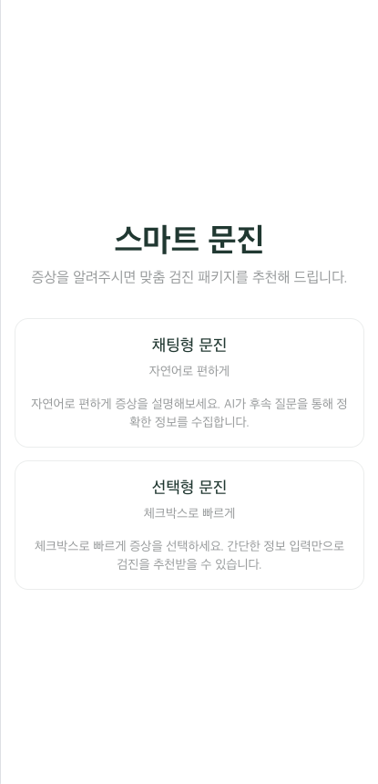
</details>

<details>
<summary>채팅형 문진</summary>

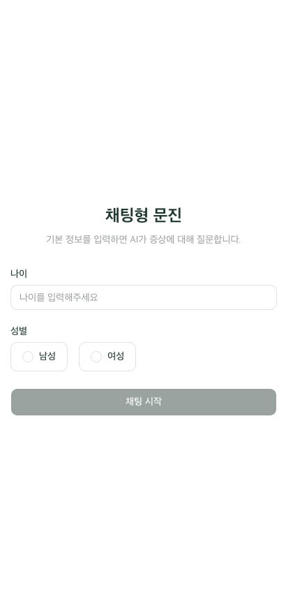
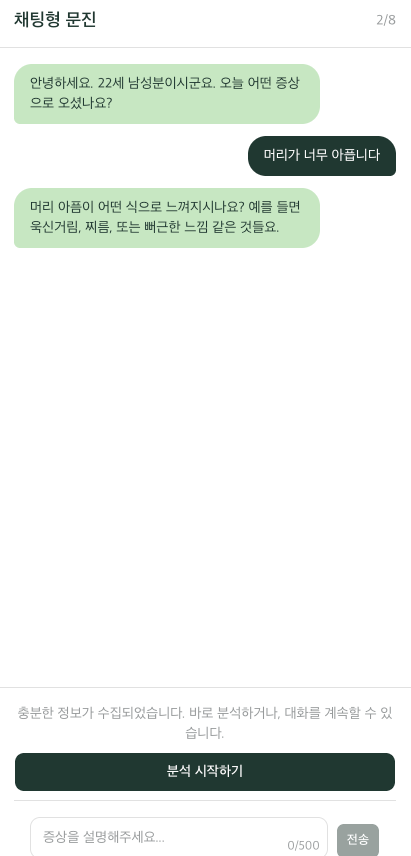

채팅 세션 시작 후 AI와 자연어 대화로 증상을 수집합니다. 턴 카운터(N/8)로 진행 상황을 표시하고, 500자 입력 제한이 적용됩니다.


</details>

<details>
<summary>선택형 문진</summary>

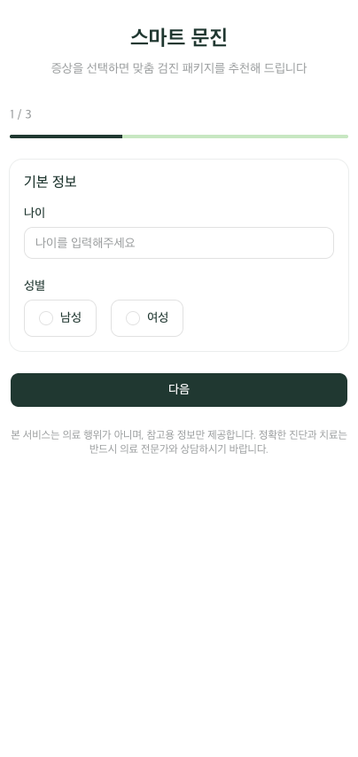
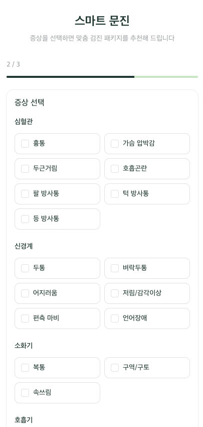

3단계 폼 (기본정보 → 증상 체크박스 → 상세정보)으로 빠르게 입력합니다.

</details>

<details>
<summary>검진 결과</summary>

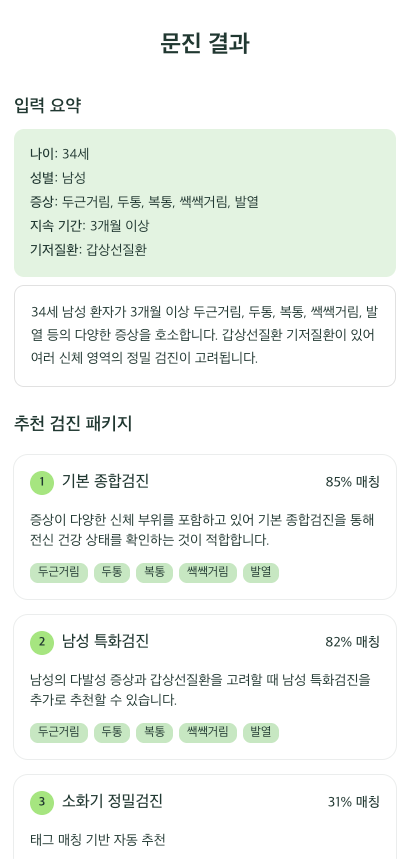

채팅형/선택형 문진 후 증상에 맞는 검진 패키지를 추천합니다.

</details>

<details>
<summary>관리자 페이지 - 대시보드</summary>

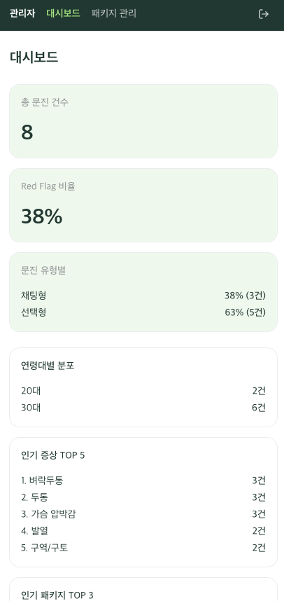

문진 결과를 관리자 페이지에서 확인할 수 있습니다. 

</details>

<details>
<summary>관리자 페이지 - 패키지 관리</summary>

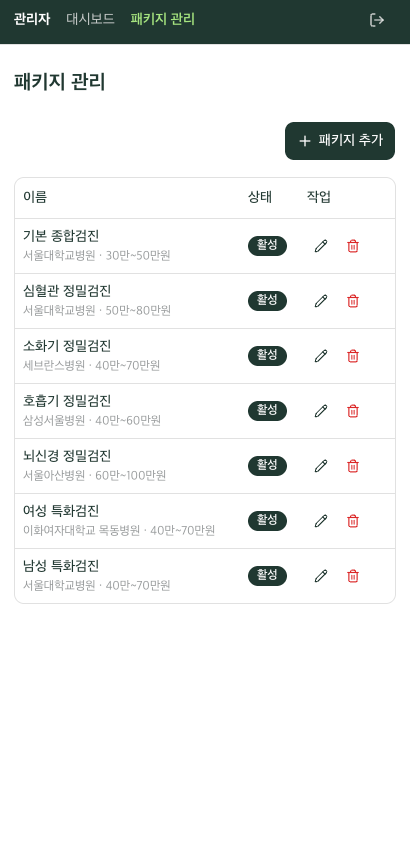
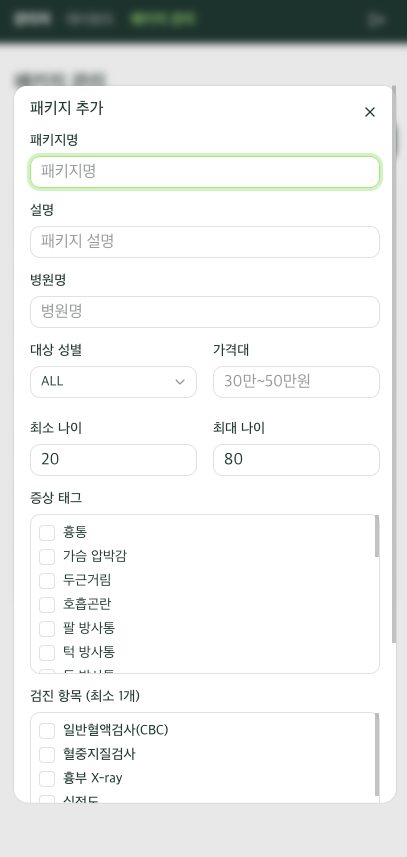

패키지 관리 페이지에서 사용자에게 추천할 검진 패키지를 관리할 수 있습니다.

</details>

## 기능

### 환자

| 기능 | 설명 |
|------|------|
| 채팅형 문진 | gpt-4.1-nano와 자연어 대화로 증상 수집 (최대 8턴) |
| 선택형 문진 | 3단계 체크박스 폼으로 증상 입력 |
| Red Flag 탐지 | 5개 응급 규칙 — EMERGENCY 감지 시 즉시 경고 + 대화 종료 |
| 결과 페이지 | 입력 요약 + LLM 분석 요약 + 추천 패키지 (최대 3개) + 추천 근거 |
| URL 공유 | `/result/{session_key}`로 결과 공유 가능 |

### 관리자

| 기능 | 설명 |
|------|------|
| 대시보드 | 총 문진 건수, 연령대별 분포, 인기 증상/패키지, Red Flag 비율, 유형별(FORM/CHAT) 통계 |
| 패키지 CRUD | 검진 패키지 생성/수정/비활성화 (soft delete) |
| 인증 | UUID 토큰 기반 (24시간 만료, 로그인 5회 실패 시 300초 잠금) |

### 보안

| 방어 대상 | 대책 |
|----------|------|
| 프롬프트 인젝션 | 11개 패턴 탐지 (영문/한국어) + LLM 미호출 |
| 토큰 남용 | 메시지 500자 제한 |
| 세션 남용 | IP당 분당 5회 / 시간당 20회 제한, 동시 활성 세션 100개 |
| LLM 비용 | 일일 호출 500회 제한 |
| 출력 유출 | API key 패턴, SQL 구문 필터링 |


## 구성 요소

| 구성 요소 | 역할 | 핵심 특징 |
|----------|------|----------|
| ChatService | 채팅형 문진 세션 관리 + LLM 대화 | 인메모리 세션, 8턴 대화, Rate Limit, TTL 30분 |
| QuestionnaireService | 선택형 문진 분석 | LLM 분석 + TagMatcher fallback |
| LLM Provider | OpenAI / Anthropic 호출 | Strategy 패턴, model_override로 모델 분리 |
| RedFlagService | 응급 증상 규칙 체크 | YAML 기반 5개 규칙 (EMERGENCY/URGENT/CAUTION) |
| TagMatcher | 태그 기반 패키지 매칭 | LLM 실패 시 fallback, relevance_score 가중치 |
| Security | 프롬프트 인젝션 방어 | 입력 패턴 탐지 11개 + 출력 금지어 필터 + 길이 제한 |

## 아키텍처

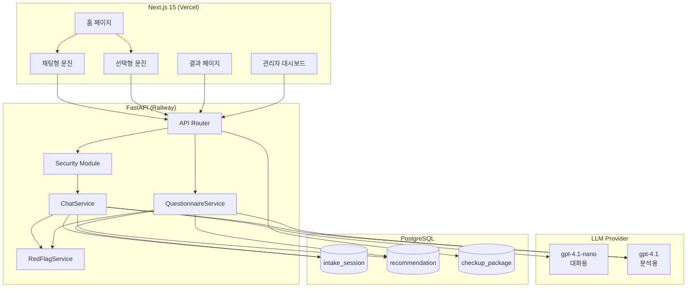

**문진 처리 흐름**

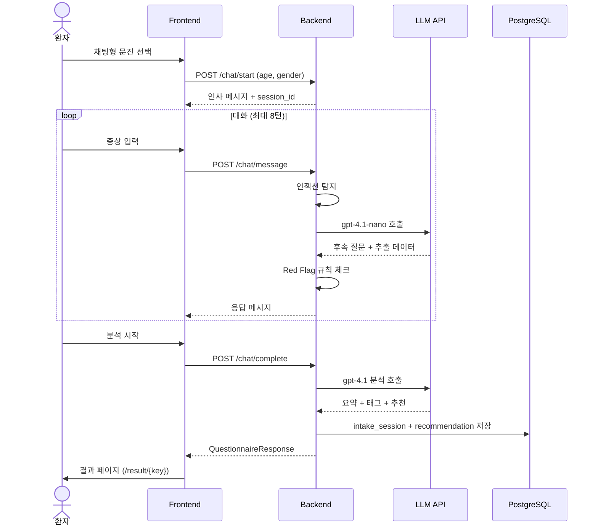


## API

Base URL: `/api/v1`

### 환자 API

| 메서드 | 경로 | 설명 |
|--------|------|------|
| POST | `/questionnaire` | 선택형 문진 제출 + 분석 |
| GET | `/result/{session_key}` | 문진 결과 조회 |

### 채팅 API

| 메서드 | 경로 | 설명 |
|--------|------|------|
| POST | `/chat/start` | 채팅 세션 시작 (age, gender) |
| POST | `/chat/message` | 대화 턴 전송 |
| POST | `/chat/complete` | 대화 종료 + 분석 |

### 관리자 API (인증 필요)

| 메서드 | 경로 | 설명 |
|--------|------|------|
| POST | `/admin/login` | 관리자 로그인 |
| GET | `/admin/stats` | 대시보드 통계 |
| GET | `/admin/packages` | 패키지 목록 |
| POST | `/admin/packages` | 패키지 생성 |
| PUT | `/admin/packages/{id}` | 패키지 수정 |
| DELETE | `/admin/packages/{id}` | 패키지 비활성화 |

## 데이터 모델

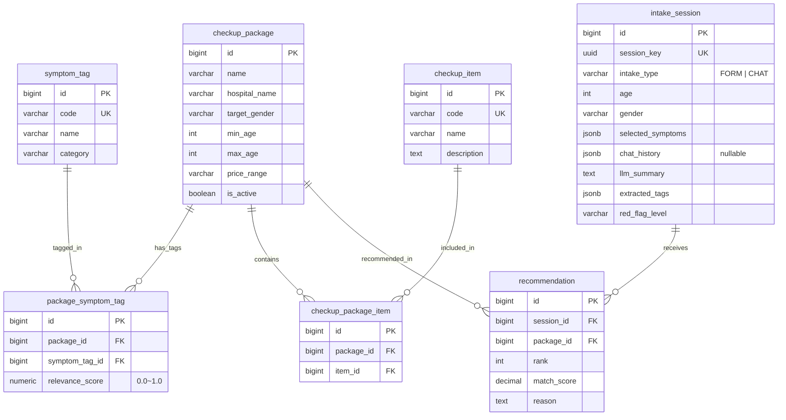

## 환경 설정

### Backend (`.env`)

| 변수 | 설명 | 기본값 |
|------|------|--------|
| `DATABASE_URL` | PostgreSQL 연결 URL | (필수) |
| `LLM_PROVIDER` | LLM 제공자 | `openai` |
| `OPENAI_API_KEY` | OpenAI API 키 | `""` |
| `ANTHROPIC_API_KEY` | Anthropic API 키 | `""` |
| `CHAT_MODEL` | 대화용 모델 | `gpt-4.1-nano` |
| `ANALYSIS_MODEL` | 분석용 모델 | `gpt-4.1` |
| `CHAT_MAX_TURNS` | 최대 대화 턴 | `8` |
| `CHAT_SESSION_TTL_MINUTES` | 세션 만료 시간 | `30` |
| `CHAT_RATE_LIMIT_PER_MINUTE` | IP당 분당 제한 | `5` |
| `DAILY_LLM_CALL_LIMIT` | 일일 LLM 호출 상한 | `500` |
| `ADMIN_PASSWORD` | 관리자 비밀번호 | (필수) |
| `CORS_ORIGINS` | 허용 도메인 | `http://localhost:3000` |

### Frontend (`.env.local`)

| 변수 | 설명 | 기본값 |
|------|------|--------|
| `NEXT_PUBLIC_API_URL` | Backend API URL | `http://localhost:8000/api/v1` |

## 디렉터리 구조

```
healthcare/
  backend/
    app/
      api/v1/
        endpoints/          ← 6개 엔드포인트 (questionnaire, chat, result, admin_*)
        router.py
      core/                 ← config, database, auth, prompts, chat_prompts, constants
      domain/
        models.py           ← SQLAlchemy ORM (7 테이블)
        schemas/             ← Pydantic DTO (patient, chat, llm, matcher, admin)
      service/
        chat_service.py     ← 채팅 세션 + LLM 대화 + 분석
        questionnaire_service.py ← 선택형 문진 분석
        llm_service.py      ← OpenAI / Anthropic Provider
        red_flag_service.py  ← YAML 기반 응급 규칙
        security.py         ← 프롬프트 인젝션 방어
        package_matcher/    ← TagMatcher (인터페이스 분리)
      seed/                 ← 초기 패키지 데이터
      main.py               ← FastAPI 진입점
    alembic/                ← DB 마이그레이션 (2개 버전)
    tests/                  ← 19개 테스트 파일 (73 passed)
    Dockerfile
    railway.toml
  frontend/
    src/
      app/
        page.tsx            ← 홈 (채팅형/선택형 선택)
        chat/               ← 채팅형 문진 (ChatContent, ChatBubble, ChatInput, TypingIndicator, RedFlagBanner)
        questionnaire/      ← 선택형 문진 (3단계 폼)
        result/[id]/        ← 결과 페이지
        admin/              ← 관리자 (login, dashboard, packages)
      components/ui/        ← shadcn/ui 컴포넌트
      hooks/                ← useChat, useResult, useAuth, useAdmin
      lib/                  ← api-client, constants, utils
      types/                ← TypeScript 타입 정의
    tests/                  ← 6개 컴포넌트 테스트
  spec/                     ← 프로젝트 정본 (spec.md, erd.md, contracts/)
  docker-compose.yml        ← PostgreSQL 16
```

## 배포

| 구성 요소 | 플랫폼 | 비용 |
|----------|--------|------|
| Frontend | Vercel Free | 무료 |
| Backend | Railway | ~$5/월 |
| Database | Railway PostgreSQL | Railway 포함 |

## 의료 면책 조항

> 본 서비스는 의료 행위가 아니며, 참고용 정보만 제공합니다. <br>
> 정확한 진단과 치료는 반드시 의료 전문가와 상담하시기 바랍니다.
